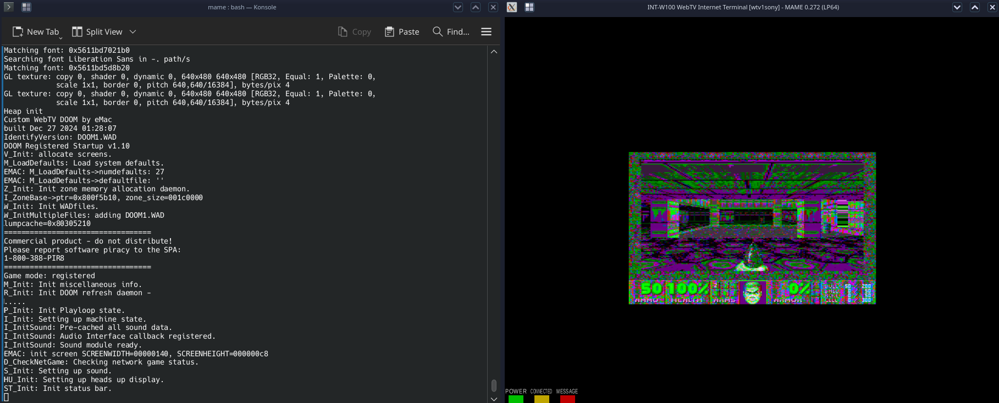

# libwtv

This is a very rough draft of an SDK that allows you to build WebTV approm and bootrom files using modern MIPS GCC tools. This is based on libdragon if you haven't noticed. I want to maintain compatability with libdragon as much as I can so you can easily port some (non-3d) N64 homebrew apps to WebTV. Possibly compile code that will run on both the N64 and WebTV to proove (at least in-part) Steve Perlman's claim that the [WebTV is more powerful than the N64](https://youtu.be/snHsbYfcWD4?t=788).

There's some hardcoded paths and oither thorns that you'd need to deal with. I plan on creating a Docker container so it's easier to setup. This is mostly in experimentation phase at the moment. Here's a list of what's currently included:

### SPOT

- Build system to create .o files for MAME and the box. Tested on MAME only right now.
- Registers defined
- Interrupt handling
- Basic video handling (drawing shapes and fonts)
- Hardware keyboard handling
- IIC handling
- Serial communication over smartcard bitbang.
- Setting the LEDs

### SOLO

- Build system to create .o files for the box. Tested on an INT-W200 only right now.
- Registers defined
- Interrupt handling
- Basic potUnit video handling  (drawing shapes and fonts)
- Interpreting IR samples for the keyboard.
- IIC handling
- Serial communication over UART.
- Setting the LEDs

A Linux MIPS executable is built then its sections are extracted and formated into WebTV's ROM executable format. I'm using [o1heap](https://github.com/pavel-kirienko/o1heap) for the memory manager. I may add the option to use other memory managers in the future. I have plans to use [lwIP](https://www.nongnu.org/lwip/2_1_x/index.html) for networking.

The examples directory shows a few approms I've been experimenting with.

This is a port of [64doom](https://github.com/jnmartin84/64doom) to the MAME bf0 version of WebTV. Doom runs at a smaller resolution than the WebTV screen and uses a different color space. The screen size will likely remain a defect on bf0 boxes but I plan to fix the colors in software. Doom on the plus uses the Solo's gfxUnit to create a RGB color table, draw the screen to a rectangle and enlarge it to fit the screen.

This is an example app that draws to the screen on the WebTV Plus (INT-W200). It shows the SSID, HD locking code stored in IIC NVRAM and some other info. It draws a poopie when you hit a key on the IR keyboard.
